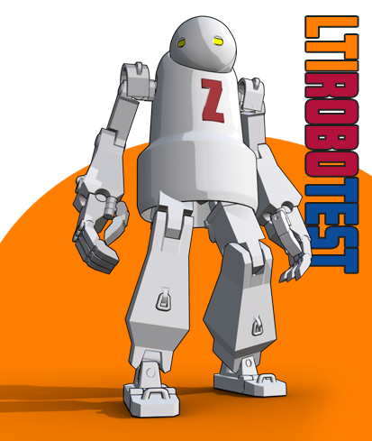

# ltirobotest

Welcome to LTI Robotest application. Less click, more tests!

It's called Robotest as it aims to test a learning platform's LTI Advantage support with as little click as possible, let's the robo do the work :)

It's very much a work in progress. It is split in 2 parts:

- **lti lib**: framework agnostic lti library, with extension points allowing customization to match the tool persistence and caching ch 
oices.
- **Robotest app**: A fast-api app using the library to implement the actual app UI. 

Launch: 

`cd robotest; uvicorn main:app --reload`

Code is using a simple code generation to create a model that is based on Dict but exposing typed parameters for the most common LTI params.

## About the robot

The robot and box models have been adapted from those models using blender:

https://sketchfab.com/3d-models/nier-automata-robot-878e4b8066064024a4ee0e8889b19904
https://sketchfab.com/3d-models/si-fi-box-d7932f22d195402bbea02db5ddb3a782
